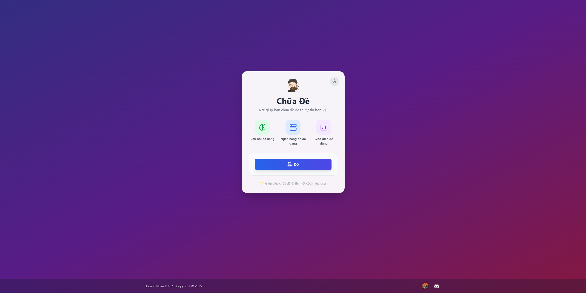

<div align="center">
  

  <h1 align="center">Chữa Đề | DoanhNhanFU 0.10</h1>
  
  <p align="center">
    Nền tảng ôn tập trắc nghiệm thế hệ mới, được thiết kế để mang lại trải nghiệm luyện đề mượt mà, trực quan và hiệu quả.
  </p>
  
  <p align="center">
    <a href="https://chuade.vercel.app/"><strong>Truy cập Trang Web »</strong></a>
    <br />
    <br />
    <a href="https://github.com/[Tên-GitHub-của-mày]/[Tên-repo-code]/issues">Báo Lỗi</a>
    ·
    <a href="https://github.com/[Tên-GitHub-của-mày]/[Tên-repo-code]/issues">Yêu Cầu Tính Năng</a>
  </p>

[](https://chuade.vercel.app/)
[](./LICENSE)
[](https://discord.gg/PXdAXnyUDR)

</div>

---

### Về Dự Án

`Chữa Đề` không chỉ là một ứng dụng trắc nghiệm thông thường. Nó là một nền tảng được xây dựng với tư duy của người học, tập trung vào trải nghiệm người dùng và hiệu quả ôn tập. Từ việc dễ dàng tạo đề bằng Excel, luyện tập với giao diện "không phiền nhiễu", cho đến các tính năng "thưởng" như pháo hoa, mọi thứ đều được thiết kế để biến việc học trở nên thú vị hơn.



### ✨ Tính Năng Nổi Bật

- **⚡ Hiệu Năng Vượt Trội:** Xây dựng trên nền tảng **Vite** + **React**, đảm bảo tốc độ tải trang và phản hồi gần như tức thì.
- **💅 Giao Diện "Gây Nghiện":**
  - Thiết kế responsive, tối giản, tập trung hoàn toàn vào nội dung.
  - Chế độ **Sáng/Tối** mượt mà, tự động lưu lựa chọn người dùng.
  - Hàng loạt hiệu ứng tinh tế: _hoa rơi_, _nền ma trận_, _viền LED RGB_, _chuyển trang/câu hỏi_,... được xây dựng bằng **Framer Motion** và CSS thuần.
- **🧠 Trải Nghiệm Luyện Đề Thông Minh:**
  - Bản đồ câu hỏi trực quan, tô màu theo kết quả **Đúng (Xanh)** / **Sai (Đỏ)**.
  - Hỗ trợ phím tắt toàn diện, cho phép "cày đề" mà không cần dùng chuột.
  - **Hiệu ứng pháo hoa** mãn nhãn để "thưởng" cho mỗi câu trả lời đúng và khi hoàn thành bài.
- **🔐 Quản Trị & Bảo Mật:**
  - Hệ thống Admin Dashboard để quản lý (Thêm/Xóa) đề thi.
  - Dễ dàng tạo và import đề từ file **Excel**.
  - Hệ thống mật khẩu chung, tự động **reset mỗi ngày** và thông báo qua **Discord Webhook** nhờ **Supabase Edge Functions** & **Cron Jobs**.

---

### 🚀 Cài Đặt và Chạy Project

Dự án này bao gồm một Frontend (React) và sử dụng Supabase làm Backend.

#### Yêu Cầu

- Node.js (v18.x+)
- Tài khoản [Supabase](https://supabase.com)
- Tài khoản [Vercel](https://vercel.com)
- Một Discord Webhook URL (tùy chọn)

#### Hướng Dẫn

1.  **Clone Kho Chứa:**

    ```bash
    git clone https://github.com/[Tên-GitHub-của-mày]/[Tên-repo-code].git
    cd [Tên-repo-code]
    ```

2.  **Cài Đặt Các Gói Phụ Thuộc:**

    ```bash
    npm install
    ```

3.  **Thiết Lập Supabase:**

    - Tạo project mới trên Supabase.
    - Tạo 2 bảng `quizzes` và `system_config` theo cấu trúc đã định nghĩa trong dự án.
    - Vào `Authentication -> Policies` và thiết lập các policy cho phép `SELECT`, `INSERT`, `DELETE` trên bảng `quizzes`.
    - Tạo các **Edge Functions** (`reset-password`, `verify-password`) và thiết lập **Cron Job** để reset mật khẩu.

4.  **Cấu Hình Biến Môi Trường:**

    - Tạo file `.env.local` ở thư mục gốc.
    - Điền các thông tin sau:

      ```env
      # Lấy từ Project Settings > API trong Supabase
      VITE_SUPABASE_URL="https://your-project-url.supabase.co"
      VITE_SUPABASE_ANON_KEY="your-anon-public-key"

      # Mật khẩu để truy cập Admin Dashboard
      VITE_ADMIN_KEY="your-secret-admin-key"

      # Link webhook của kênh Discord
      DISCORD_WEBHOOK_URL="your-discord-webhook-url"
      ```

    - Bạn cũng cần set `DISCORD_WEBHOOK_URL` trong **Supabase Secrets** để Edge Function có thể sử dụng.

5.  **Chạy Project:**
    ```bash
    npm run dev
    ```

---

### 🛠️ Bộ "Đồ Nghề" Công Nghệ

| Loại           | Công Nghệ                                                                                                                                                                                        |
| -------------- | ------------------------------------------------------------------------------------------------------------------------------------------------------------------------------------------------ |
| **Framework**  |   |
| **Ngôn Ngữ**   |                                                                                  |
| **Styling**    |                                                                              |
| **Backend**    |                                                                                        |
| **Animation**  |                                                                              |
| **Deployment** |                                                                                               |

---

### ©️ Copyright

Một sản phẩm được xây dựng với niềm đam mê. Copyright © 2025 **Doanh Nhân FU 0.10**.

Dự án này là một hành trình học hỏi và phát triển. Cảm ơn bạn đã ghé thăm!
